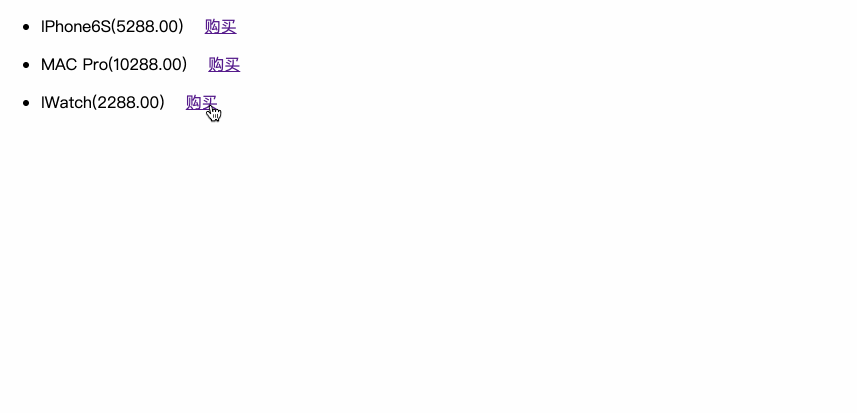

# Distributed transaction framework——TCC 

## 项目结构

- tyloo-api
  这个模块放的是一些相关的API
- tyloo-core
  主要存放一些事务核心的类，比如两个AoP的拦截器，Repository库等
- tyloo-spring
  Spring框架和事务通过继承整合在这里
- tyloo-tutorial-sample
  业务模块
- tyloo-unit-test
  测试以及工具模块

## 项目展示

## 详细文档

Detailed documentation.md

Detailed documentation1.md

Project summary.txt

